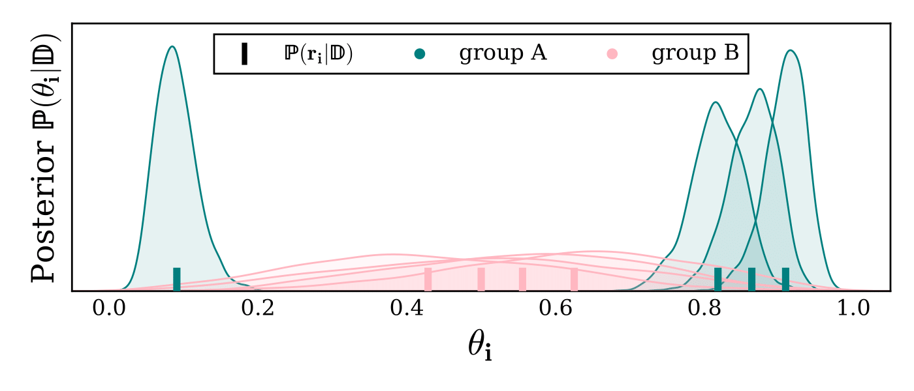

# Fairness in Ranking under Disparate Uncertainty

| **[Installation](#installation)**
| **[Examples](#examples)**
| **[Citation](#citation)**

Ranking is a ubiquitous method for focusing the attention of human evaluators on a manageable subset of options. Its use as part of human decision-making processes ranges from surfacing potentially relevant products on an e-commerce site to prioritizing college applications for human review. While ranking can make human evaluation more effective by focusing attention on the most promising options, we argue that it can introduce unfairness if the uncertainty of the underlying relevance model differs between groups of options. Unfortunately, such disparity in uncertainty appears widespread, often to the detriment of minority groups for which relevance estimates can have higher uncertainty due to a lack of data or appropriate features. To address this fairness issue, we propose Equal-Opportunity Ranking (EOR) as a new fairness criterion for ranking and show that it corresponds to a group-wise fair lottery among the relevant options even in the presence of disparate uncertainty. 
EOR optimizes for an even cost burden on all groups, unlike the conventional \emph{Probability Ranking Principle}, and is fundamentally different from existing notions of fairness, such as \emph{demographic parity} that is motivated by proportional representation by size. Furthermore, unlike affirmative action interventions like proportional \emph{Rooney rule} constraints, EOR does not require the designation of a disadvantaged group.  
To make EOR ranking practical, we present an efficient algorithm for computing it in time $O(n \log(n))$ and prove its close approximation guarantee to the globally optimal solution. 
In a comprehensive empirical evaluation on synthetic data, a US Census dataset, and a real-world audit of Amazon search queries, we find that the algorithm reliably guarantees EOR fairness while providing effective rankings.

<!--  -->


<!-- ## Acknowledgements -->


## Installation

Set up and activate the Python environment by executing

```
conda env create -f environment.yml
conda activate ranking_uncertainty
```

<!-- SLURM system can be used to run jobs. An example script for submitting SLURM job is given in ```./scripts/combined_sbatch.sub```.
In the scripts folder, customize the script ```init_env.sh``` for your environment and path. This path is then referenced in ```./scripts/combined_sbatch.sub``` . -->


<!-- ## Examples
Notebook  "Duality Thm1" for evaluating the theorem 6.1 example of cost optimality gap.

Notebook  "Markup_Amazon_Analysis" for analysis of Amazon search queries experiment.

Notebook  "USCensus_experiment" and "Census_plot" for experiment and plotting of USCensus dataset.

Notebook  "Synthetic plots" can be used to run synthetic examples for given $G$ groups and specific expected relevance estimates $P(r_i|D)$. -->

## Citation


## Feedback
